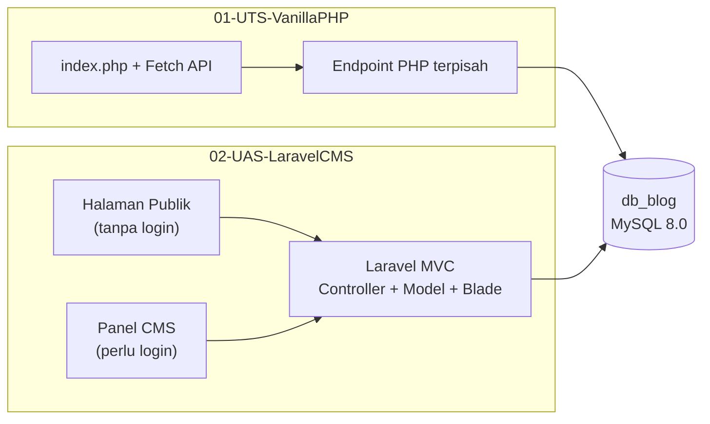

<div align="center">

# Sistem Manajemen Blog (CMS)

Repositori ini berisi proyek **Sistem Manajemen Blog (CMS)** untuk mata kuliah **Pemrograman Web** — dari implementasi PHP native (UTS) hingga pengembangan berbasis **Laravel** dengan halaman publik pengunjung (UAS).


</div>

---

## Daftar Isi

1. [Informasi Proyek](#informasi-proyek)
2. [Gambaran Umum](#gambaran-umum)
3. [Struktur Repositori](#struktur-repositori)
4. [Arsitektur & Alur Aplikasi](#arsitektur--alur-aplikasi)
5. [Basis Data](#basis-data)
6. [Modul 1 — UTS (Vanilla PHP)](#modul-1--uts-vanilla-php)
7. [Modul 2 — UAS (Laravel CMS + Halaman Publik)](#modul-2--uas-laravel-cms--halaman-publik)
8. [Prasyarat](#prasyarat)
9. [Cara Menjalankan Aplikasi](#cara-menjalankan-aplikasi)
10. [Akun Default & Akses Aplikasi](#akun-default--akun-akses-aplikasi)
11. [Ringkasan Route & Endpoint](#ringkasan-route--endpoint)
12. [Keamanan](#keamanan)
13. [Dokumentasi Pendukung](#dokumentasi-pendukung)
14. [Panduan Pengumpulan Tugas](#panduan-pengumpulan-tugas)
15. [Troubleshooting](#troubleshooting)

---

## Informasi Proyek

| Item | Keterangan |
|---|---|
| **Mata Kuliah** | Pemrograman Web |
| **Dosen** | A'la Syauqi, M.Kom. |
| **Semester** | Genap 2025/2026 |
| **Nama Lengkap** | Muhammad Nailul Ghufron Majid |
| **NIM** | 240605110160 |
| **Video Demonstrasi** | link |

---

## Gambaran Umum

Proyek ini berkembang dalam **dua tahap**:

| Tahap | Folder | Teknologi | Tujuan |
|---|---|---|---|
| **UTS** | `01-UTS-VanillaPHP/` | PHP native, MySQL, JavaScript (Fetch API) | CMS satu halaman dengan CRUD penulis, artikel, dan kategori — tanpa reload halaman |
| **UAS** | `02-UAS-LaravelCMS/` | Laravel 11, Eloquent ORM, Blade, Bootstrap 5 | CMS dengan autentikasi penulis **+** halaman publik untuk pengunjung umum |

Kedua modul menggunakan database yang sama: **`db_blog`**, dengan tiga tabel inti (`penulis`, `kategori_artikel`, `artikel`) dan relasi foreign key antar tabel.



---

## Struktur Repositori

```
CMS_Project_Teory_Web_Programming/
│
├── README.md                      # Dokumentasi utama (file ini)
│
├── 01-UTS-VanillaPHP/             # Proyek UTS — PHP native
│   ├── index.php                  # Halaman utama (UI + JavaScript)
│   ├── koneksi.php                # Koneksi database
│   ├── db_blog.sql                # Skrip SQL inisialisasi database
│   ├── docker-compose.yml
│   ├── Dockerfile
│   ├── ambil_*.php / simpan_*.php # Endpoint CRUD (REST-like)
│   ├── uploads_penulis/           # Foto profil penulis
│   └── uploads_artikel/           # Gambar artikel
│
├── 02-UAS-LaravelCMS/             # Proyek Modul 10 & UAS — Laravel CMS + halaman publik
│   ├── app/
│   │   ├── Http/Controllers/      # Controller CMS & publik
│   │   └── Models/                # Eloquent models
│   ├── database/
│   │   ├── migrations/            # Definisi struktur tabel
│   │   └── seeders/               # Data awal (akun admin)
│   ├── resources/views/
│   │   ├── layouts/               # Layout CMS & publik (terpisah)
│   │   ├── public/                # Halaman pengunjung
│   │   ├── artikel/ penulis/ kategori/  # Halaman CMS
│   │   └── login/ dashboard/
│   ├── routes/web.php             # Definisi route
│   ├── docker-compose.yml
│   └── Dockerfile
│
└── doc/                           # Materi & soal ujian
    ├── Uts_Web_Programming.md     # Soal UTS
    ├── Soal_UAS.md                # Soal UAS
    └── Bab_10.md                  # Materi Laravel (Modul 10)
```

---

## Arsitektur & Alur Aplikasi

### UTS — Pendekatan SPA sederhana

```
Browser (index.php)
    │
    ├── Fetch API ──► ambil_penulis.php / simpan_penulis.php / ...
    ├── Fetch API ──► ambil_artikel.php  / simpan_artikel.php  / ...
    └── Fetch API ──► ambil_kategori.php / simpan_kategori.php / ...
                            │
                            ▼
                      MySQL (db_blog)
```

Seluruh operasi CRUD berjalan **asynchronous** via Fetch API. Halaman tidak di-reload; feedback ditampilkan melalui toast notification.

### UAS — Arsitektur MVC Laravel

```
Pengunjung (tanpa login)          Penulis (setelah login)
        │                                  │
        ▼                                  ▼
  PublicController                ArtikelController
  (/, /artikel/{id})              PenulisController
                                  KategoriArtikelController
        │                                  │
        └──────────────┬───────────────────┘
                       ▼
              Eloquent Models
         (Artikel, Penulis, KategoriArtikel)
                       │
                       ▼
                 MySQL (db_blog)
```

**Pemisahan tanggung jawab (UAS):**

- **Controller publik** (`PublicController`) terpisah dari controller CMS.
- **Layout Blade publik** (`layouts/public.blade.php`) terpisah dari layout CMS (`layouts/app.blade.php`).
- **Route publik** tidak dilindungi middleware `auth`; route CMS dilindungi.

---

## Basis Data

Database: **`db_blog`** · Charset: **`utf8mb4`**

### Diagram Relasi

```
┌─────────────┐         ┌──────────────────┐         ┌─────────────┐
│   penulis   │         │     artikel      │         │  kategori   │
│             │◄────────│                  │────────►│  _artikel   │
│ id (PK)     │  1 : N  │ id (PK)          │  N : 1  │ id (PK)     │
│ nama_depan  │         │ id_penulis (FK)  │         │ nama_kategori│
│ nama_belakang│        │ id_kategori (FK) │         │ keterangan  │
│ user_name   │         │ judul            │         └─────────────┘
│ password    │         │ isi              │
│ foto        │         │ gambar           │
└─────────────┘         │ hari_tanggal     │
                        └──────────────────┘
```

### Skema Tabel

```sql
-- Tabel penulis
CREATE TABLE penulis (
  id            INT PRIMARY KEY AUTO_INCREMENT,
  nama_depan    VARCHAR(100) NOT NULL,
  nama_belakang VARCHAR(100) NOT NULL,
  user_name     VARCHAR(50)  NOT NULL UNIQUE,
  password      VARCHAR(255) NOT NULL,
  foto          VARCHAR(255) NOT NULL
);

-- Tabel kategori_artikel
CREATE TABLE kategori_artikel (
  id            INT PRIMARY KEY AUTO_INCREMENT,
  nama_kategori VARCHAR(100) NOT NULL UNIQUE,
  keterangan    TEXT
);

-- Tabel artikel
CREATE TABLE artikel (
  id           INT PRIMARY KEY AUTO_INCREMENT,
  id_penulis   INT NOT NULL,
  id_kategori  INT NOT NULL,
  judul        VARCHAR(255) NOT NULL,
  isi          TEXT NOT NULL,
  gambar       VARCHAR(255) NOT NULL,
  hari_tanggal VARCHAR(50)  NOT NULL,
  FOREIGN KEY (id_penulis)  REFERENCES penulis(id) ON DELETE RESTRICT,
  FOREIGN KEY (id_kategori) REFERENCES kategori_artikel(id) ON DELETE RESTRICT
);
```

> File SQL lengkap tersedia di `01-UTS-VanillaPHP/db_blog.sql`. Proyek Laravel menggunakan migration di `02-UAS-LaravelCMS/database/migrations/`.

---

## Modul 1 — UTS (Vanilla PHP)

Folder: [`01-UTS-VanillaPHP/`](01-UTS-VanillaPHP/)

### Fitur

| Modul | Fitur |
|---|---|
| **Kelola Penulis** | CRUD lengkap, upload foto profil, password di-hash (BCRYPT), penulis yang masih punya artikel tidak bisa dihapus |
| **Kelola Artikel** | CRUD lengkap, upload gambar wajib, dropdown penulis & kategori dinamis, `hari_tanggal` otomatis (timezone Asia/Jakarta) |
| **Kelola Kategori** | CRUD lengkap, kategori yang masih punya artikel tidak bisa dihapus |
| **UI/UX** | Dark mode, responsive design, navigation drawer mobile, toast notification, modal konfirmasi hapus |

### Teknologi

| Teknologi | Peran |
|---|---|
| PHP 8.x | Backend & endpoint API |
| MySQL 8.0 | Database |
| JavaScript (Fetch API) | Operasi CRUD tanpa reload |
| HTML5 & CSS3 | Antarmuka |
| Docker | Containerisasi environment |

### Endpoint API

Setiap entitas memiliki 5 endpoint dengan pola penamaan konsisten:

| Operasi | Penulis | Artikel | Kategori |
|---|---|---|---|
| **Read (list)** | `ambil_penulis.php` | `ambil_artikel.php` | `ambil_kategori.php` |
| **Read (satu)** | `ambil_satu_penulis.php` | `ambil_satu_artikel.php` | `ambil_satu_kategori.php` |
| **Create** | `simpan_penulis.php` | `simpan_artikel.php` | `simpan_kategori.php` |
| **Update** | `update_penulis.php` | `update_artikel.php` | `update_kategori.php` |
| **Delete** | `hapus_penulis.php` | `hapus_artikel.php` | `hapus_kategori.php` |

Dokumentasi detail modul ini: [`01-UTS-VanillaPHP/README.md`](01-UTS-VanillaPHP/README.md)

---

## Modul 2 — UAS (Laravel CMS + Halaman Publik)

Folder: [`02-UAS-LaravelCMS/`](02-UAS-LaravelCMS/)

### Fitur CMS (Panel Administrator)

Hanya dapat diakses setelah **login** sebagai penulis.

| Modul | Fitur |
|---|---|
| **Autentikasi** | Login/logout menggunakan model `Penulis`, session-based auth |
| **Dashboard** | Halaman ringkasan setelah login |
| **Kelola Penulis** | Resource CRUD (RESTful), upload foto via Laravel Storage |
| **Kelola Artikel** | Resource CRUD, upload gambar, penulis otomatis dari user login |
| **Kelola Kategori** | Resource CRUD |
| **Validasi** | Server-side validation Laravel, flash message notifikasi |
| **Pola PRG** | Post-Redirect-Get untuk mencegah resubmit form |

### Fitur Halaman Publik (Pengunjung)

Dapat diakses **tanpa login** oleh siapa saja.

| Halaman | Route | Keterangan |
|---|---|---|
| **Beranda** | `/` | Menampilkan **5 artikel terbaru** + widget kategori di sidebar |
| **Filter kategori** | `/?kategori={id}` | Artikel difilter berdasarkan kategori yang diklik |
| **Detail artikel** | `/artikel/{id}` | Isi lengkap artikel + **5 artikel terkait** dari kategori yang sama |
| **Navigasi** | — | Tombol "Baca Selengkapnya" ke detail, dan navigasi "Kembali ke Beranda" (termasuk pada halaman login) |

### Teknologi

| Teknologi | Peran |
|---|---|
| Laravel 11 | Framework MVC |
| PHP 8.2+ | Runtime |
| Eloquent ORM | Interaksi database & relasi model |
| Blade | Template engine |
| Bootstrap 5 | UI framework (CMS & publik) |
| MySQL 8.0 | Database |
| Vite + Tailwind CSS | Asset bundling (opsional, untuk dev) |
| Docker | Containerisasi environment |

### Struktur MVC (Laravel)

```
app/
├── Http/Controllers/
│   ├── PublicController.php        # Halaman publik (UAS)
│   ├── LoginController.php         # Autentikasi
│   ├── DashboardController.php     # Dashboard CMS
│   ├── ArtikelController.php       # CRUD artikel
│   ├── PenulisController.php       # CRUD penulis
│   └── KategoriArtikelController.php
└── Models/
    ├── Artikel.php                 # belongsTo Penulis, KategoriArtikel
    ├── Penulis.php                 # hasMany Artikel, Authenticatable
    └── KategoriArtikel.php         # hasMany Artikel
```

---

## Prasyarat

Pilih salah satu metode instalasi di bawah.

### Metode Docker (Direkomendasikan)

- [Docker](https://docs.docker.com/get-docker/) ≥ 20.x
- [Docker Compose](https://docs.docker.com/compose/install/) ≥ 2.x

### Metode Manual (Lokal)

| Komponen | UTS | UAS |
|---|---|---|
| PHP | 8.x + ekstensi `mysqli` | 8.2+ + ekstensi `pdo_mysql`, `mbstring`, `xml`, `gd` |
| MySQL | 8.0 | 8.0 |
| Composer | — | ≥ 2.x |
| Node.js & npm | — | ≥ 18.x (opsional, untuk Vite) |
| Web server | Apache (XAMPP/LAMP) | `php artisan serve` atau Apache/Nginx |

---

## Cara Menjalankan Aplikasi

### A. UTS — Vanilla PHP

#### Menggunakan Docker

```bash
cd 01-UTS-VanillaPHP
docker compose up -d
```

| Layanan | URL |
|---|---|
| Aplikasi CMS | http://localhost:8080 |
| phpMyAdmin | http://localhost:8081 |

Database `db_blog` otomatis dibuat dari `db_blog.sql` saat container pertama kali dijalankan.

#### Menggunakan XAMPP / LAMP

1. Salin folder `01-UTS-VanillaPHP/` ke `htdocs/` (XAMPP) atau `/var/www/html/` (LAMP).
2. Import `db_blog.sql` melalui phpMyAdmin.
3. Sesuaikan kredensial di `koneksi.php`:

```php
$host = 'localhost';
$user = 'root';
$pass = '';       // sesuaikan password MySQL Anda
$db   = 'db_blog';
```

4. Buka browser: `http://localhost/01-UTS-VanillaPHP/`

---

### B. UAS — Laravel CMS

#### Menggunakan Docker

```bash
cd 02-UAS-LaravelCMS
docker compose up -d
```

Container akan otomatis menjalankan:

- `php artisan migrate --force`
- `php artisan db:seed --force`
- `php artisan storage:link --force`
- `php artisan serve --host=0.0.0.0 --port=8000`

| Layanan | URL |
|---|---|
| Aplikasi Laravel | http://localhost:8000 |
| phpMyAdmin | http://localhost:8082 |
| MySQL (host) | `localhost:3307` |

#### Menggunakan Lokal (Manual)

```bash
cd 02-UAS-LaravelCMS

# 1. Instal dependensi
composer install
npm install        # opsional

# 2. Konfigurasi environment
cp .env.example .env
php artisan key:generate
```

Edit file `.env` — ubah konfigurasi database:

```env
APP_NAME="Sistem Manajemen Blog"
APP_URL=http://localhost:8000
APP_TIMEZONE=Asia/Jakarta

DB_CONNECTION=mysql
DB_HOST=127.0.0.1
DB_PORT=3306
DB_DATABASE=db_blog
DB_USERNAME=root
DB_PASSWORD=
```

```bash
# 3. Siapkan database
# Buat database db_blog di MySQL, lalu:
php artisan migrate
php artisan db:seed
php artisan storage:link

# 4. Jalankan server
php artisan serve
```

Buka http://localhost:8000

> **Penting:** File `.env` berisi kredensial sensitif dan **tidak boleh** di-commit ke GitHub. File ini sudah terdaftar di `.gitignore`.

---

## Akun Default & Akses Aplikasi

### UAS — Login CMS

Setelah menjalankan seeder (`php artisan db:seed`), akun default tersedia:

| Field | Nilai |
|---|---|
| Username | `admin` |
| Password | `admin123` |

URL login: http://localhost:8000/login

### Ringkasan URL

| Modul | Halaman | URL |
|---|---|---|
| **UAS Publik** | Beranda | http://localhost:8000/ |
| **UAS Publik** | Detail artikel | http://localhost:8000/artikel/{id} |
| **UAS CMS** | Login | http://localhost:8000/login |
| **UAS CMS** | Dashboard | http://localhost:8000/dashboard |
| **UAS CMS** | Kelola artikel | http://localhost:8000/artikel |
| **UAS CMS** | Kelola penulis | http://localhost:8000/penulis |
| **UAS CMS** | Kelola kategori | http://localhost:8000/kategori |
| **UTS** | CMS (semua fitur) | http://localhost:8080 |

---

## Ringkasan Route & Endpoint

### UAS — Route Laravel (`routes/web.php`)

**Halaman publik (tanpa auth):**

| Method | URI | Controller | Nama Route |
|---|---|---|---|
| GET | `/` | `PublicController@index` | `public.index` |
| GET | `/artikel/{id}` | `PublicController@show` | `public.show` |

**Autentikasi:**

| Method | URI | Keterangan |
|---|---|---|
| GET | `/login` | Form login (hanya guest) |
| POST | `/login` | Proses login |
| POST | `/logout` | Logout (perlu auth) |

**CMS (dilindungi middleware `auth`):**

| Resource | URI Prefix | Controller |
|---|---|---|
| Dashboard | `/dashboard` | `DashboardController` |
| Artikel | `/artikel` | `ArtikelController` |
| Penulis | `/penulis` | `PenulisController` |
| Kategori | `/kategori` | `KategoriArtikelController` |

---

## Keamanan

### UTS (Vanilla PHP)

| Aspek | Implementasi |
|---|---|
| SQL Injection | Prepared statements (`mysqli`) |
| XSS | `htmlspecialchars()` pada output |
| Upload file | Validasi tipe via `finfo`, batas ukuran file |
| Password | `password_hash()` dengan `PASSWORD_BCRYPT` |
| Direktori upload | `.htaccess` mencegah eksekusi PHP di folder upload |

### UAS (Laravel)

| Aspek | Implementasi |
|---|---|
| Autentikasi | Session guard, middleware `auth` pada route CMS |
| SQL Injection | Eloquent ORM & query builder |
| XSS | Blade auto-escaping (`{{ }}`) |
| CSRF | Token CSRF pada setiap form POST |
| Upload file | Validasi Laravel (`image`, `mimes`, `max`), Laravel Storage |
| Password | `Hash::make()` (bcrypt) |
| Environment | `.env` di-exclude dari Git |

---

## Dokumentasi Pendukung

| File | Isi |
|---|---|
| [`doc/Uts_Web_Programming.md`](doc/Uts_Web_Programming.md) | Soal dan ketentuan UTS |
| [`doc/Soal_UAS.md`](doc/Soal_UAS.md) | Soal dan ketentuan UAS |
| [`doc/Bab_10.md`](doc/Bab_10.md) | Materi Laravel — Model, Database, dan CRUD |
| [`01-UTS-VanillaPHP/README.md`](01-UTS-VanillaPHP/README.md) | Dokumentasi detail proyek UTS |

---

## Panduan Pengumpulan Tugas

Sesuai ketentuan dosen, hasil pekerjaan dikumpulkan melalui Google Classroom:

### Repositori GitHub

- Repositori **publik**
- Format nama: `aplikasi-blog-[nim]` (contoh: `aplikasi-blog-123456`)
- Sertakan seluruh kode proyek
- **Jangan** commit file `.env`
- README harus memuat: nama, NIM, deskripsi, cara menjalankan, dan tautan video

### Video YouTube

- Durasi maksimal **10 menit**
- Demonstrasi berurutan:
  1. CMS — CRUD penulis, kategori, dan artikel
  2. Halaman beranda — 5 artikel terbaru
  3. Filter artikel per kategori via widget sidebar
  4. Halaman detail artikel + artikel terkait
  5. Navigasi "Kembali ke Beranda"

| Ujian | Batas Pengumpulan |
|---|---|
| UTS | Rabu, 29 Mei 2026 — 23.59 WIB |
| UAS | Sabtu, 13 Juni 2026 — 23.59 WIB |

---

## Troubleshooting

### Port sudah digunakan

Ubah mapping port di `docker-compose.yml` jika port 8080, 8000, 3306, atau 3307 bentrok dengan layanan lain.

### Database connection refused (Laravel)

- Pastikan MySQL sudah berjalan.
- Periksa nilai `DB_HOST`, `DB_PORT`, `DB_USERNAME`, dan `DB_PASSWORD` di `.env`.
- Saat Docker: gunakan `DB_HOST=db` (nama service), bukan `127.0.0.1`.

### Gambar tidak tampil (Laravel CMS)

Jalankan symbolic link storage dari root project Laravel Anda:

```bash
php artisan storage:link
```

Gambar artikel CMS disimpan di `storage/app/public/gambar/` dan diakses via `/storage/gambar/`. Foto penulis di `/storage/foto/`. (Catatan: Pastikan Anda memanggil path folder dengan benar pada View).

### Migration error

```bash
# Reset database (hati-hati: menghapus semua data)
php artisan migrate:fresh --seed
```

### Permission error (upload)

```bash
chmod -R 775 storage bootstrap/cache
```

### UTS — Koneksi database gagal di Docker

Pastikan service `db` sudah healthy sebelum `app` diakses. Periksa bahwa `koneksi.php` menggunakan host `db` (bukan `localhost`) saat dijalankan via Docker Compose.

---

## Lisensi

Proyek ini dibuat sebagai bagian dari pemenuhan tugas mata kuliah **Pemrograman Web**. Kode Laravel mengikuti [MIT License](https://opensource.org/licenses/MIT).

---
