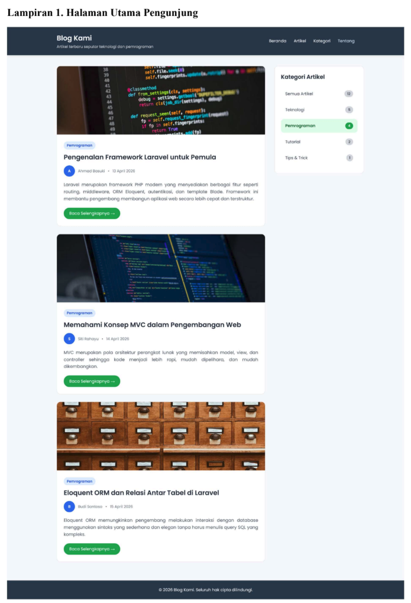
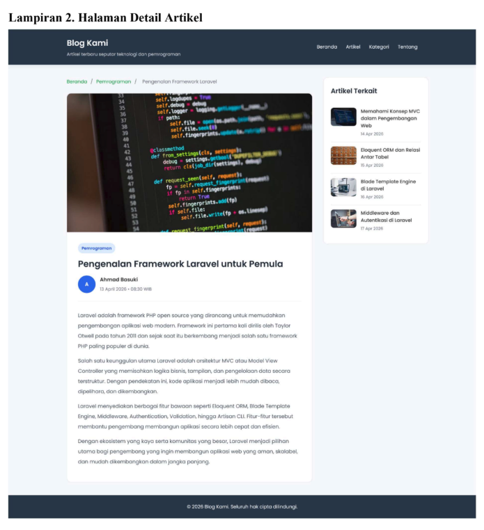

## **SOAL UJIAN AKHIR SEMESTER (UAS)** 

|Mata Kuliah||Pemrograman Web|
|---|---|---|
|Dosen||A’la Syauqi M.Kom.|
|Semester||Genap 2025/2026|
|Sifat Ujian||Take Home Test|
|Batas Pengumpulan||Sabtu, 13 Juni 2026 Pukul 23.59 WIB|

## **Deskripsi Studi Kasus** 

Sistem Manajemen Blog (CMS) yang telah dibangun pada Modul 10 sudah memiliki fitur pengelolaan konten secara lengkap, yaitu pengelolaan artikel, penulis, dan kategori artikel melalui antarmuka yang hanya dapat diakses oleh penulis yang sudah login. Namun hingga saat ini, konten yang dikelola melalui CMS tersebut belum dapat dikunjungi oleh pengunjung umum karena belum tersedia halaman publik yang menampilkan artikel kepada pembaca. 

Pada UAS ini, proyek aplikasi-blog yang telah dibangun pada Modul 10 dikembangkan lebih lanjut dengan menambahkan dua halaman pengunjung yang dapat diakses oleh siapa saja tanpa perlu login. Halaman pengunjung dibangun menggunakan framework Laravel dengan memanfaatkan database db_blog dan data yang sudah dikelola melalui CMS. 

Halaman pertama adalah **halaman utama** yang menampilkan lima artikel terbaru beserta widget kategori artikel di bagian samping. Pengunjung dapat menyaring artikel berdasarkan kategori dengan mengklik salah satu item kategori di widget tersebut. Contoh tampilan halaman utama dapat dilihat pada Lampiran 1. Halaman kedua adalah **halaman detail artikel** yang menampilkan isi lengkap artikel yang dipilih beserta lima artikel terkait dari kategori yang sama di bagian samping. Contoh tampilan halaman detail artikel dapat dilihat pada Lampiran 2. 

Tampilan halaman pengunjung dirancang dengan tema yang bersih, sederhana, dan elegan diperbolehkan menggunakan CSS atau framework Bootstrap. Diharapkan tampilan tema konsisten dengan tema pada CMS di Modul 10. 

## **Ketentuan Teknis** 

Pengerjaan UAS mengikuti ketentuan teknis berikut: 

## **1. Prasyarat** 

Proyek aplikasi-blog dari Modul 10 harus sudah selesai dikerjakan dan berfungsi dengan benar sebelum memulai pengerjaan UAS ini. Database db_blog beserta seluruh tabelnya harus sudah tersedia dan terisi dengan data yang cukup untuk mendemonstrasikan seluruh fitur halaman pengunjung. 

## **2. Proyek Laravel** 

Halaman pengunjung dibangun di dalam proyek aplikasi-blog yang sama dengan Modul 10. Tidak diperkenankan membuat proyek Laravel baru. 

## **3. Database** 

Database yang digunakan adalah db_blog dengan struktur tabel yang sama dengan Modul 10 dan soal UTS, yaitu tabel penulis, kategori_artikel, dan artikel. Tidak diperkenankan mengubah struktur tabel yang sudah ada. 

## **4. Framework dan Tampilan** 

Halaman pengunjung dibangun menggunakan framework Laravel dengan tampilan diperbolahkan menggunakan CSS atau framework Bootstrap. Tema warna dan gaya tampilan mengacu pada Lampiran 1 dan Lampiran 2. Kreativitas dalam pengembangan tampilan diperbolehkan selama tetap memenuhi kriteria bersih, sederhana, dan elegan. 

## **5. Akses Halaman** 

Halaman pengunjung dapat diakses oleh siapa saja tanpa perlu login. Route halaman pengunjung tidak dilindungi oleh middleware auth. 

## **6. Arsitektur** 

Halaman pengunjung diimplementasikan menggunakan arsitektur MVC Laravel dengan ketentuan sebagai berikut: 

- Controller halaman pengunjung dibuat terpisah dari Controller CMS yang sudah ada 

- Seluruh Route halaman pengunjung didefinisikan di file routes/web.php 

- Tampilan menggunakan Blade template engine dengan layout tersendiri yang terpisah dari layout CMS 

## **7. Pengumpulan** 

Hasil pekerjaan dikumpulkan dalam bentuk: 

- Tautan repositori GitHub yang bersifat publik berisi seluruh kode program proyek aplikasiblog 

- Tautan video YouTube yang bersifat publik atau unlisted yang mendemonstrasikan sistem pengelolaan konten (CMS/halaman administrator) dan fitur halaman pengunjung secara lengkap 

## **Format Pengumpulan** 

Hasil pekerjaan dikumpulkan dalam bentuk dua tautan yaitu tautan repositori GitHub dan tautan video YouTube. Kedua tautan dikumpulkan melalui google classroom sebelum batas waktu pengumpulan yaitu Sabtu, 13 Juni 2026 pukul 23.59 WIB. 

## **1. Repositori GitHub** 

Ketentuan repositori GitHub: 

- Repositori bersifat publik sehingga dapat diakses oleh siapa saja 

- Nama repositori menggunakan format: aplikasi-blog-[nim], contoh: aplikasi-blog-123456 

- Seluruh kode program proyek aplikasi-blog diunggah ke repositori tersebut 

- Pastikan file .env tidak ikut diunggah ke repositori karena berisi informasi sensitif seperti kredensial database. File .env sudah terdaftar di .gitignore secara default sehingga tidak akan ikut ter-commit 

- Sertakan file README.md di repositori yang berisi informasi berikut: 

   - Nama lengkap dan NIM 

   - Deskripsi singkat aplikasi 

- Langkah-langkah menjalankan aplikasi secara lokal 

- Tautan video YouTube demonstrasi 

## **2. Video YouTube** 

Ketentuan video YouTube: 

- Video bersifat publik atau unlisted yang penting dapat ditonton melalui tautan 

- Durasi video maksimal 10 menit 

- Video mendemonstrasikan seluruh fitur halaman pengunjung secara berurutan: 

   - Menampilkan halaman administrastor/CMS dan memperagakan create, update, delete untuk penulis, kategori artikel, dan artikel. 

   - Menampilkan halaman utama pengunjung dengan 5 artikel terbaru. 

   - Mengklik salah satu kategori di widget dan memastikan artikel tersaring dengan benar. 

   - Mengklik tombol “Kelanjutannya” pada salah satu artikel dan memastikan halaman detail tampil dengan benar. 

   - Memastikan widget artikel terkait menampilkan artikel dari kategori yang sama 

   - Mengklik salah satu artikel terkait dan memastikan halaman detail artikel yang sesuai tampil dengan benar. 

   - Mengklik tautan "Kembali ke Beranda" dan memastikan kembali ke halaman utama. 

   - Pastikan seluruh fitur terlihat jelas di video dan tidak ada bagian yang terpotong. 

## **Lampiran 1. Halaman Utama Pengunjung** 

**==> picture [180 x 11] intentionally omitted <==**

**----- Start of picture text -----**
 Lampiran 2. Halaman Detail Artikel 

**----- End of picture text -----** 
